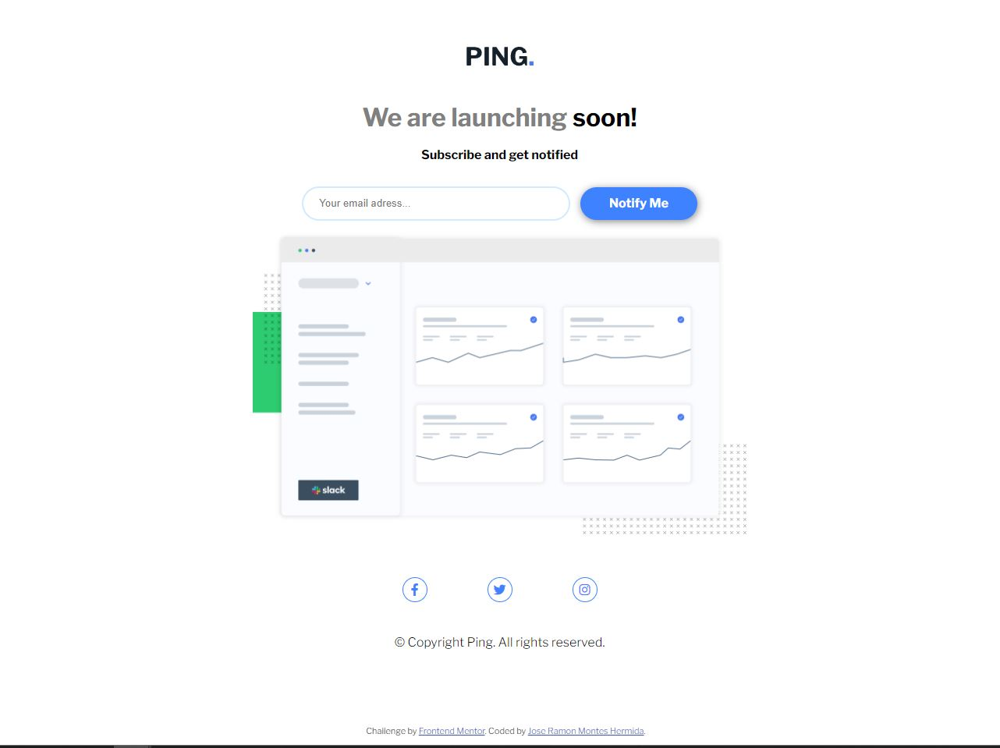

# Frontend Mentor - Ping coming soon page solution

This is a solution to the [Ping coming soon page challenge on Frontend Mentor](https://www.frontendmentor.io/challenges/ping-single-column-coming-soon-page-5cadd051fec04111f7b848da). Frontend Mentor challenges help you improve your coding skills by building realistic projects. 

## Table of contents

- [Overview](#overview)
  - [Screenshot](#screenshot)
- [My process](#my-process)
  - [Built with](#built-with)
- [Author](#author)

## Overview

In this Frontend Mentor project I have created an email validator, I have used HTML, CSS and JavaScript

### Screenshot

## My process

I started creating the structure in HTML, the divs, classes etc...

So I gave it the shape I wanted with CSS, using different attributes and properties.

Finally, for the validator to work, I used javascript, creating a function that goes through a regular expression to know if the entered email is valid or not.

### Built with

- Semantic HTML5 markup
- CSS custom properties
- Flexbox
- CSS Grid
- JavaScript
- Font Awesome for social icons

## Author

- TikTok - [@elrincondeldev](https://www.tiktok.com/@elrincondeldev)
- Instagram - [@elrincondeldev](https://www.instagram.com/elrincondeldev/)
